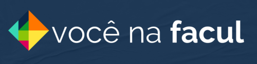

 
   

<h1 align="center">Frontend Você na Facul</h1>

   
   
   
   
   
   
 

 <h2>Descrição</h2>
 
Somos uma equipe de voluntários trabalhando por um bem maior: a EDUCAÇÃO. Queremos que o ambiente universitário seja justo e igualitário, e que o desejo de ingressar no ensino superior não dependa de cor, gênero, orientação sexual ou classe social.

<h2>Ambiente</h2>

   <h5>Desenvolvimento</h5>
   
Para rodar o projeto em ambiente de <strong>Desenvolvimento</strong>, siga os passos abaixo:

   <ol>
      <li>Clone o repositório</li>
      <li>Execute o comando <code>yarn</code> para instalar as dependências</li>
      <li>Verifique se existe o arquivo <code>.env.development</code> na raiz do projeto</li>
      <li>Execute o comando <code>yarn dev</code> para rodar o projeto</li>
      <li>Abra o navegador e acesse <code>http://localhost:5173</code></li>
      <li>Para fins de login, clone o repositório de backend em <a href="https://github.com/vcnafacul/api-vcnafacul" style="text-decoration: none;"><code>api-vcnafacul</code></a></li>
   </ol>
   <h5>Homologação</h5>
   
Para rodar o projeto em ambiente de <strong>Homologação</strong> ...

   <ul>
      <li>Se seu sistema for windows, necessário instalar Docker Desktop</li>
      <li>Para os demais sistemas ou utilizando o <strong>
         Windows Subsystem for Linux</strong> <code>wsl</code>, o docker é necessário, mas caso não possua, será instalado durante o processo de subida da aplicação.</li>
   </ul>
   

      
Processo de Up do ambiente de homologação

      <ol>
         <li>Verifique se existe o arquivo <code>.env.qa</code>, caso não, crie um a partir de <code>.env.qa.example</code> e preencha as informações pertinentes</li>
         <li>Rode o script <code>./run_qa.sh</code></li>
         <ul>
            <li>Em sistemas windows, o arquivo deve ser executado no terminal <code>git bash</code></li>
         </ul>
         <li>O processo de up das aplicações <code>client-vcnafacul</code>, <code>api-vcnafacul</code> e <code>ms-vcnafacul</code> levá um tempo para</li>
         <ul>
            <li>Instalar o docker, caso não possua</li>
            <li>Baixar as imagens do projeto do repositorio do <strong>Docker Hub</strong></li>
            <li>Subir a aplicação</li>
         </ul>
         <li>Uma vez o processo ser finalizado com <code>done</code>, abra o navegador e acesse <code>http://localhost:5173</code></li>
      </ol>
   

<h2>Principais tecnologias neste projeto</h2>
<ul>
   <li><a href="https://react.dev/">React</a></li>
   <li><a href="https://www.typescriptlang.org/">Typescript</a></li>
   <li><a href="https://vite.dev/">Vite</a></li>
   <li><a href="https://tailwindcss.com/">Tailwind</a></li>
   <li><a href="https://zustand-demo.pmnd.rs/">Zustand</a></li>
</ul>

<h2>Principais tecnologias nos demais projetos</h2>
<ul>
   <li><a href="https://nestjs.com/">Nest JS</a></li>
   <li><a href="https://www.postgresql.org/">Postgresql</a></li>
   <li><a href="https://nginx.org/en/">Nginx</a></li>
   <li><a href="https://nodejs.org/en">Node</a></li>
   <li><a href="https://www.mysql.com/">MySQL</a></li>
   <li><a href="https://swagger.io/">Swagger</a></li>
   <li><a href="https://www.docker.com/">Docker</a></li>
   <li><a href="https://www.figma.com/">Figma</a></li>
   <li><a href="https://www.mongodb.com/">Mongo</a></li>
   <li><a href="https://flutter.dev/">Flutter</a></li>
   <li><a href="https://developer.android.com/studio?gad_source=1&gclid=Cj0KCQjwyL24BhCtARIsALo0fSCm5HC_WNjMLeSGsHUKnDvYUvNm9x7AwLrVOCATI_eQU-l-ssdlUm8aApfWEALw_wcB&gclsrc=aw.ds&hl=pt-br">Android Studio</a></li>
</ul>

## Contribuição

Sinta-se à vontade para abrir uma issue ou um pull request caso queira contribuir. Toda ajuda é bem-vinda!

## Contato

Se tiver alguma dúvida, entre em contato através do nosso site [Você na Facul](https://vcnafacul.com.br).
